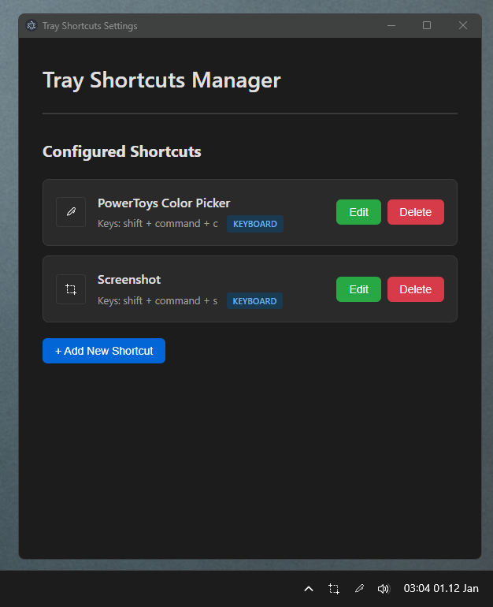

# Windows Tray Shortcuts

A flexible Windows system tray application that lets you create multiple customizable tray icons, each triggering keyboard shortcuts or launching executables with a single click.




## Development

```bash
# Install dependencies
npm install

# Run the application
npm start

# Build the portable executable
npm run build:win
```

## Building

```bash
# Install dependencies
npm install

# Build portable Windows executable
npm run build:win
```

Output: `dist/PowerToysColorPickerTray.exe` (portable, no installation required)

## Project Structure

```
windows-tray-shortcuts/
├── main.js                          # Electron entry point
├── package.json                     # Project configuration
│
├── src/                             # Core application logic
│   ├── config/
│   │   └── ConfigManager.js         # JSON config persistence
│   ├── tray/
│   │   └── TrayManager.js           # Multi-tray orchestration
│   ├── shortcuts/
│   │   └── ShortcutExecutor.js      # Keyboard & exe execution
│   ├── windows/
│   │   └── SettingsWindow.js        # Settings window management
│   └── utils/
│       ├── AutoLaunch.js            # Windows startup integration
│       └── IconManager.js           # Icon scanning & management
│
├── renderer/                        # Settings UI (Electron renderer)
│   ├── settings.html                # Settings window structure
│   ├── settings.css                 # Dark theme styles
│   ├── settings.js                  # Settings UI logic
│   └── preload.js                   # IPC context bridge
│
├── icons/                           # 1669+ light icons
├── icons-black/                     # Dark icon variants
├── icon.png                         # Application exe icon
└── tray-icon.png                    # Default tray icon
```

## License

MIT License - feel free to use and modify as needed.

## Credits

Originally forked from a single-purpose PowerToys Color Picker tray application, now evolved into a flexible multi-shortcut management platform.
