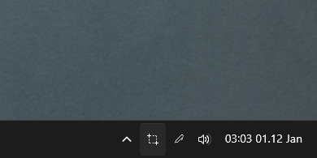

# Windows Tray Shortcuts

A flexible Windows system tray application that lets you create multiple customizable tray icons, each triggering keyboard shortcuts or launching executables with a single click.



## Features

- **Multiple Tray Icons** - Create as many tray shortcuts as you need
- **Keyboard Shortcuts** - Simulate any keyboard combination (e.g., Win+Shift+C for PowerToys Color Picker)
- **Executable Launchers** - Launch any program with optional command-line arguments
- **Custom Icons** - Choose from 1669+ built-in icons (light and dark variants)
- **Settings UI** - Easy-to-use settings window for managing all shortcuts
- **Run on Startup** - Optional Windows startup integration via right-click menu
- **Dark Theme** - Modern dark-themed settings interface

## Quick Start

### Download
Download the latest portable executable from the [Releases](https://github.com/math0ne/windows-tray-shortcuts/releases) page.

### Development

```bash
# Install dependencies
npm install

# Run the application
npm start

# Build the portable executable
npm run build:win
```

## Usage

### Creating Shortcuts

1. Right-click any tray icon and select **Settings**
2. Click **+ Add New Shortcut**
3. Configure your shortcut:
   - **Name**: Display name for the tray icon
   - **Type**: Choose between Keyboard Shortcut or Executable
   - **Icon**: Search and select from 1669+ icons (light/dark variants)

#### Keyboard Shortcuts
- Select modifier keys (Ctrl, Shift, Alt, Win)
- Choose main key from dropdown (letters, numbers, function keys, special keys)
- Preview shows the complete shortcut combination

#### Executable Shortcuts
- Click **Browse...** to select an .exe file
- Optionally add command-line arguments

### Managing Shortcuts

- **Edit**: Click the Edit button on any shortcut in the settings list
- **Delete**: Click the Delete button to remove a shortcut
- **Execute**: Left-click the tray icon or right-click → "Trigger [Name]"

### Run on Startup

Right-click any tray icon and check **Run on Windows startup** to launch the app automatically when Windows starts. This adds a registry entry to run the tray app - it does not automatically trigger shortcuts.

## Example Use Cases

- **PowerToys Color Picker**: Win+Shift+C keyboard shortcut
- **Screenshot Tool**: Win+Shift+S for Windows Snipping Tool
- **Quick Calculator**: Launch calculator.exe instantly
- **Custom Scripts**: Run batch files or PowerShell scripts with arguments
- **Application Launchers**: One-click access to frequently used programs

## Project Structure

```
windows-tray-shortcuts/
├── main.js                          # Electron entry point
├── package.json                     # Project configuration
│
├── src/                             # Core application logic
│   ├── config/
│   │   └── ConfigManager.js         # JSON config persistence
│   ├── tray/
│   │   └── TrayManager.js           # Multi-tray orchestration
│   ├── shortcuts/
│   │   └── ShortcutExecutor.js      # Keyboard & exe execution
│   ├── windows/
│   │   └── SettingsWindow.js        # Settings window management
│   └── utils/
│       ├── AutoLaunch.js            # Windows startup integration
│       └── IconManager.js           # Icon scanning & management
│
├── renderer/                        # Settings UI (Electron renderer)
│   ├── settings.html                # Settings window structure
│   ├── settings.css                 # Dark theme styles
│   ├── settings.js                  # Settings UI logic
│   └── preload.js                   # IPC context bridge
│
├── icons/                           # 1669+ light icons
├── icons-black/                     # Dark icon variants
├── icon.png                         # Application exe icon
└── tray-icon.png                    # Default tray icon
```

## Configuration

Settings are stored in `%APPDATA%\powertoys-color-picker-tray\config.json`

Example configuration:
```json
{
  "version": "2.0",
  "shortcuts": [
    {
      "id": "uuid",
      "name": "PowerToys Color Picker",
      "type": "keyboard",
      "icon": "tray-icon.png",
      "iconType": "light",
      "enabled": true,
      "action": {
        "keys": ["shift", "command", "c"]
      }
    },
    {
      "id": "uuid",
      "name": "Calculator",
      "type": "executable",
      "icon": "calculator.png",
      "iconType": "light",
      "enabled": true,
      "action": {
        "path": "C:\\Windows\\System32\\calc.exe",
        "args": []
      }
    }
  ],
  "settings": {
    "runOnStartup": false
  }
}
```

## Technical Details

- **Framework**: Electron (desktop app framework)
- **Keyboard Simulation**: robotjs (native keyboard automation)
- **Process Spawning**: Node.js child_process for launching executables
- **Auto-Launch**: Windows Registry (HKCU\Software\Microsoft\Windows\CurrentVersion\Run)
- **Context Isolation**: Secure IPC via contextBridge
- **Build**: electron-builder (portable Windows executable)

## Keyboard Key Support

Supported keys include:
- Letters (A-Z)
- Numbers (0-9)
- Function keys (F1-F12)
- Special keys (Escape, Tab, Enter, Space, Backspace, Delete, Insert, Print Screen)
- Navigation (Home, End, Page Up/Down, Arrow keys)
- Numpad (0-9)
- Modifiers (Ctrl, Shift, Alt, Win)

**Note**: Some system-level keys like Print Screen may not reliably trigger OS functions through robotjs. Use Win+Shift+S for screenshots or Win+Print Screen as alternatives.

## Building

```bash
# Install dependencies
npm install

# Build portable Windows executable
npm run build:win
```

Output: `dist/PowerToysColorPickerTray.exe` (portable, no installation required)

## CI/CD

GitHub Actions automatically builds the application on:
- Push to main branch
- Pull requests
- Manual workflow_dispatch

The workflow creates timestamped releases with the portable executable attached.

## License

MIT License - feel free to use and modify as needed.

## Credits

Originally forked from a single-purpose PowerToys Color Picker tray application, now evolved into a flexible multi-shortcut management platform.
